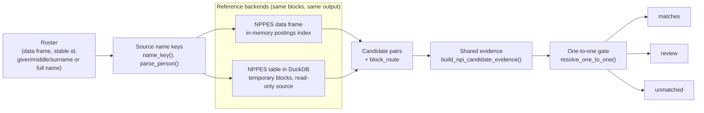
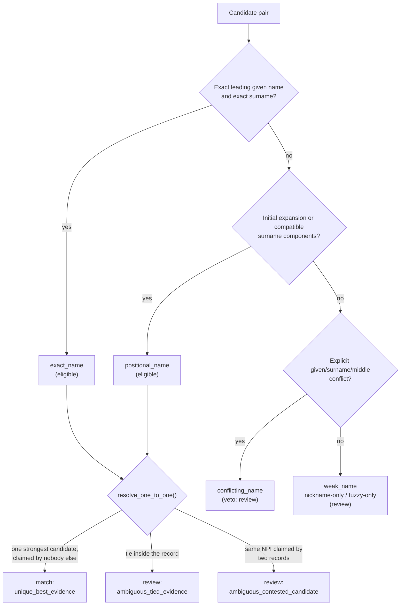

```{r, include = FALSE}
knitr::opts_chunk$set(collapse = TRUE, comment = "#>", fig.width = 7, fig.height = 4)
library(mysterynpi)
duckdb_available <- requireNamespace("DBI", quietly = TRUE) &&
  requireNamespace("duckdb", quietly = TRUE)
# mysterymaps is installed from GitHub (mufflyt/mysterymaps), so it is not a
# declared dependency: the map chunks run only when it is present and the
# vignette builds without it. The function is fetched by name for the same
# reason -- a bare `mysterymaps::` reference would read as an undeclared import.
state_map <- tryCatch(getExportedValue("mysterymaps", "mysterymaps_geographic_map"),
                      error = function(e) NULL)
maps_available <- !is.null(state_map) &&
  all(vapply(c("maps", "ggplot2"), requireNamespace, logical(1), quietly = TRUE))
```

`match_npi()` takes a roster of people you hold (a mystery-caller sample, a
board list, a study cohort) and the NPPES Type 1 file, and returns every
roster row in exactly one of three partitions -- `matches`, `review`,
`unmatched` -- together with the candidates it weighed and the reason it gave
each one. The whole vignette runs on synthetic data: no network, no private
provider records, no mounted drive.

Two things make this different from "join on name":

1. **Candidates are generated inside bounded blocks**, never by comparing
   every roster row with every national row. Exact surname and given keys,
   surname-component variants, an exact-surname nickname block, and
   single-character deletion signatures each retrieve a small set of rows;
   the union of those sets is everything the evidence layer ever sees.
2. **Nothing resolves on a tie, a nickname alone, or a fuzzy route alone.**
   A roster row gets an NPI only when exactly one eligible candidate holds its
   strongest evidence and no other roster row holds the same NPI at full
   strength. Everything else goes to `review` with a stable reason, and the
   candidate identities stay in `candidates` so a reviewer can finish the job.

## Two data paths, one policy

The reference data can be an R data frame (fine for a state extract or a
specialty subset) or a DuckDB table (the right choice for the full national
file). The backends differ only in where the blocks are built; evidence,
tie behaviour, reason codes, and the output schema are shared code.



The evidence layer orders candidates by named classes, not by a score. Only
the two strongest classes are *eligible*; the rest can reach review but never
resolve.



## A synthetic roster and a synthetic NPPES extract

Twelve roster rows, each built to exercise one path. NPIs are synthetic but
pass the Luhn check, because invalid NPIs are excluded before matching and we
want these rows to survive that gate.

```{r roster}
roster <- data.frame(
  record = sprintf("r%02d", 1:12),
  first  = c("Jane", "R.", "Anne", "Bob", "Xlice", "Mary", "Carol", "Carol",
             NA, "Zelda", "Jose", "Maria"),
  middle = c(NA, NA, NA, NA, NA, NA, "Ann", "Ann", NA, NA, NA, "Elena"),
  last   = c("Doe", "Brown", "Nelson Becker", "Smith", "Smith", "Jones", "White",
             "White", "Lee", "Zzyzx", "Garcia", "Lopez"),
  state  = c("CO", "CO", "CO", "RI", "RI", "RI", "TX", "TX", "TX", "NM", "NM", "NM"),
  credential = c("MD", NA, "MD", NA, NA, "MD", "MD", NA, NA, NA, "MD", NA),
  stringsAsFactors = FALSE)

nppes <- data.frame(
  NPI = c("1234567893", "1046000000", "1053000000", "1245319599", "1004000000",
          "1012000000", "1020000000", "1038000000", "1061000000", "1079000000",
          "1234567890", "1087000000"),
  `Entity Type Code` = c(rep("1", 10), "1", "2"),
  `Provider First Name` = c("Jane", "Robert", "Anne", "Robert", "Alice", "Mary",
                            "Mary", "Carol", "José", "Maria", "Jane", "Jane"),
  `Provider Middle Name` = c(NA, NA, NA, NA, NA, NA, NA, "Ann", NA, "E", NA, NA),
  `Provider Last Name (Legal Name)` = c("Doe", "Brown", "Nelson-Becker", "Smith",
                                        "Smith", "Jones", "Jones", "White", "García",
                                        "Lopez", "Doe", "Doe"),
  `Provider Credential Text` = c("M.D.", NA, "MD", NA, NA, "D.O.", "M.D.", "MD", NA,
                                 NA, NA, NA),
  `Provider Business Practice Location Address State Name` =
    c("CO", "CO", "CO", "RI", "RI", "CO", "RI", "TX", "NM", "NM", "CO", "CO"),
  check.names = FALSE, stringsAsFactors = FALSE)
```

The last two reference rows are deliberate noise: an NPI that fails the Luhn
check, and a Type 2 organisation that happens to be called "Jane Doe". Neither
can ever become a candidate.

## Path one: a data frame in memory

```{r memory}
result <- match_npi(
  roster, nppes,
  id = "record", given = "first", middle = "middle", surname = "last",
  npi = "NPI", entity_type = "Entity Type Code",
  nppes_given = "Provider First Name", nppes_middle = "Provider Middle Name",
  nppes_surname = "Provider Last Name (Legal Name)")

str(result$counts)
```

Every roster row is in exactly one partition, with its source columns intact:

```{r partitions}
show <- function(x) x[, c("record", "first", "last", "state", "npi", "reason")]
show(result$matches)
show(result$review)
show(result$unmatched)
```

Reading the reasons:

* `unique_best_evidence` -- one eligible candidate at the record's strongest
  class, claimed by no other record. "R. Brown" resolves to Robert Brown
  because an initial expanding to a full given name on an exact surname is
  positional evidence, and nothing else in the block competes. "José García"
  resolves to "Jose Garcia" because keys are compared after accent folding.
* `nickname_only_evidence` -- Bob Smith against Robert Smith. The nickname
  dictionary corroborates, but nickname evidence alone never auto-resolves;
  the candidate is kept for a human.
* `fuzzy_only_evidence` -- "Xlice Smith" reached Alice Smith through a
  one-character deletion signature. A fuzzy route surfaces a suggestion and
  nothing more.
* `ambiguous_tied_evidence` -- two Mary Joneses with different NPIs hold the
  same strongest evidence for one roster row.
* `ambiguous_contested_candidate` -- two roster rows (r07 and r08) each
  uniquely select the same Carol Ann White. Neither gets her: a shared NPI at
  full strength is a review item, not a coin toss.
* `missing_required_name` -- r09 has no given name, so no candidate was ever
  generated for it.
* `no_candidate` -- Zelda Zzyzx matched no block.

The `candidates` component is the audit trail. One row per source/NPI identity,
with the blocking routes that reached it and the evidence that classified it:

```{r candidates}
result$candidates[, c("source_id", "npi", "block_routes", "evidence_class",
                      "middle_evidence", "nickname_evidence", "disposition", "reason")]
```

## Path two: the same table in DuckDB

For the national file, load NPPES into DuckDB once and pass the connection.
The workflow never writes a persistent table: it registers the small roster
and its block keys as connection-scoped temporaries, builds the reference
blocks in SQL, and brings back candidate pairs only. A read-only connection is
the normal operating mode and is what we use here.

```{r duckdb, eval = duckdb_available}
path <- tempfile(fileext = ".duckdb")
con <- suppressMessages(DBI::dbConnect(duckdb::duckdb(), path))
DBI::dbWriteTable(con, "npidata", nppes)
DBI::dbDisconnect(con, shutdown = TRUE)

con <- suppressMessages(DBI::dbConnect(duckdb::duckdb(), path, read_only = TRUE))
result_db <- match_npi(
  roster, con, table = "npidata",
  id = "record", given = "first", middle = "middle", surname = "last",
  npi = "NPI", entity_type = "Entity Type Code",
  nppes_given = "Provider First Name", nppes_middle = "Provider Middle Name",
  nppes_surname = "Provider Last Name (Legal Name)")
DBI::dbDisconnect(con, shutdown = TRUE)
unlink(path)

identical(result_db$matches, result$matches)
identical(result_db$review, result$review)
identical(result_db$unmatched, result$unmatched)
identical(result_db$candidates, result$candidates)
```

The two manifests differ only in the backend and table they record:

```{r manifest, eval = duckdb_available}
differs <- names(result$run_manifest)[!mapply(identical, result$run_manifest,
                                              result_db$run_manifest)]
differs
result_db$run_manifest[c("backend", "table", "package_version", "nickname_policy",
                         "reference_rows", "reference_rows_filtered",
                         "reference_excluded_invalid_npi", "reference_rows_usable")]
```

## Breaking ties with what else you know

Names tie. Against the national file, "R. Brown" meets every Robert, Rachel,
and Richard Brown at the same strength, and the gate rightly refuses to pick
one. What breaks a tie is a second field the two sources recorded
independently. `attributes` maps up to six of them -- `state`, `gender`,
`credential`, `taxonomy`, `license`, `graduation_year` -- and each is judged
by the package's own rule for that field (`gender_agreement()`,
`normalize_credential()`, `taxonomy_consistent()`, `license_agreement()`,
`graduation_year_agreement()`), never by a bespoke comparison. The verdicts
are the same three words as everywhere else: a conflict vetoes the candidate
into `review` with reason `<attribute>_conflict`, a corroboration counts
toward `attribute_rank` (the tie-break after evidence class and middle
name), and absence on either side is uninformative.

Mary Jones (r06) tied between two reference rows. The roster says she is in
Rhode Island and an MD; one reference Mary Jones is in Colorado and a DO:

```{r attributes}
result_attr <- match_npi(
  roster, nppes,
  id = "record", given = "first", middle = "middle", surname = "last",
  npi = "NPI", entity_type = "Entity Type Code",
  nppes_given = "Provider First Name", nppes_middle = "Provider Middle Name",
  nppes_surname = "Provider Last Name (Legal Name)",
  attributes = list(
    state = c(roster = "state",
              nppes = "Provider Business Practice Location Address State Name"),
    credential = c(roster = "credential", nppes = "Provider Credential Text")))

show(result_attr$matches)
result_attr$candidates[result_attr$candidates$source_id == "r06",
                       c("npi", "evidence_class", "state_evidence", "credential_evidence",
                         "attribute_rank", "disposition", "reason")]
```

Two things did not change, on purpose. The Carol White contest (r07 and
r08) still stands: both roster rows are in Texas, both corroborate, and a
shared NPI at full strength is a review item regardless of how much else
agrees. And the Colorado Mary Jones was not deleted; she is in `candidates`
with the reason a reviewer needs.

If you would rather treat a field as a true blocking variable -- a conflict
means "not a candidate at all" -- name it in `block`. The rows are removed
before evidence and counted:

```{r block}
result_block <- match_npi(
  roster, nppes,
  id = "record", given = "first", middle = "middle", surname = "last",
  npi = "NPI", entity_type = "Entity Type Code",
  nppes_given = "Provider First Name", nppes_middle = "Provider Middle Name",
  nppes_surname = "Provider Last Name (Legal Name)",
  attributes = list(
    state = c(roster = "state",
              nppes = "Provider Business Practice Location Address State Name")),
  block = "state")

result_block$counts$blocked_by_attribute
nrow(result_block$candidates)
```

Against NPPES the usual maps are `Provider Sex Code` for `gender`,
`Healthcare Provider Taxonomy Code_1` for `taxonomy` (the roster side holds
a code or a prefix such as `207V`), and `Provider License Number_1` with
`Provider License Number State Code_1` for `license` (which can only
corroborate: a quarter of NPIs carry more than one license, so a different
number is not a disagreement). NPPES has no graduation year; map
`graduation_year` to a credentialing or enumeration year from another source,
and keep it out of `block`: beyond ten years is a flag, not proof of a
different person. Practice state moves with careers, so `state` is strongest
as a tie-break and should be blocked on only when the roster's state is
current.

## Where the rows went

The candidate funnel: from the reference table through the entity filter and
the validity gates to the pairs the blocks retrieved, the identities the
evidence layer scored, and the records that resolved.

```{r funnel, fig.alt = "Bar chart of the candidate funnel from reference rows to matches."}
counts <- result$counts
funnel <- c(`reference rows` = counts$reference$input,
            `Type 1` = counts$reference$entity_type,
            `usable (valid NPI, named)` = counts$reference$usable,
            `candidate pairs` = counts$candidate_pairs,
            `candidate identities` = counts$candidates,
            `matches` = counts$matches)
op <- par(mar = c(4, 12, 1, 1))
barplot(rev(funnel), horiz = TRUE, las = 1, col = "grey70", border = NA,
        xlab = "rows")
par(op)
```

Dispositions by reason, which is the view a review queue is planned from:

```{r dispositions, fig.alt = "Bar chart of roster rows by disposition reason."}
reasons <- table(c(result$matches$reason, result$review$reason, result$unmatched$reason))
op <- par(mar = c(4, 14, 1, 1))
barplot(sort(reasons), horiz = TRUE, las = 1, col = "grey70", border = NA,
        xlab = "roster rows")
par(op)
```

## Linkage outcomes on a map

With `mysterymaps` installed, the roster's own state field gives a state-level
view of linkage outcomes. The maps describe *this roster's* match rate per
state and nothing else: they say nothing about provider availability or
quality, and no NPPES address is geocoded (the roster carries a state, not a
street address).

```{r map-data}
outcome <- rbind(result$matches, result$review, result$unmatched)
outcome$matched <- as.integer(outcome$reason == "unique_best_evidence")
outcome$needs_review <- as.integer(outcome$record %in% result$review$record)
aggregate(cbind(matched, needs_review) ~ state, data = outcome, FUN = mean)
```

```{r map-matched, eval = maps_available, fig.alt = "State choropleth of the synthetic roster's match rate."}
print(state_map(outcome, state_col = "state", outcome_col = "matched",
                fill_label = "Matched", title = "Share of roster rows with a unique NPI",
                subtitle = "Synthetic roster; four states; not a measure of provider supply",
                low_states_warn = 0L))
```

```{r map-review, eval = maps_available, fig.alt = "State choropleth of the synthetic roster's review rate."}
print(state_map(outcome, state_col = "state", outcome_col = "needs_review",
                fill_label = "Needs review", title = "Share of roster rows routed to review",
                subtitle = "Synthetic roster; the review queue a team would work",
                palette = "magma", low_states_warn = 0L))
```

```{r map-missing, eval = !maps_available, echo = FALSE, results = "asis"}
cat("*`mysterymaps` is not installed in this build, so the two state maps",
    "(match rate and review rate by state) are skipped. Install it with",
    "`remotes::install_github(\"mufflyt/mysterymaps\")` and rebuild.*")
```

## Using it on real data

Both forms below are shown, not run. The national NPPES file is several
gigabytes; the DuckDB path keeps it on disk.

A full extract already loaded into R, using the standard NPPES headers:

```{r national-df, eval = FALSE}
nppes_full <- readr::read_csv("npidata_pfile.csv", col_types = readr::cols(.default = "c"))
result <- match_npi(
  my_roster, nppes_full,
  id = "roster_id", given = "first_name", surname = "last_name",
  npi = "NPI", entity_type = "Entity Type Code",
  nppes_given = "Provider First Name", nppes_middle = "Provider Middle Name",
  nppes_surname = "Provider Last Name (Legal Name)")
```

An existing DuckDB database, opened read-only, with the table named explicitly
(a `DBI::Id()` works for a schema-qualified table):

```{r national-db, eval = FALSE}
con <- DBI::dbConnect(duckdb::duckdb(), "nppes.duckdb", read_only = TRUE)
result <- match_npi(
  my_roster, con, table = DBI::Id(schema = "main", table = "npidata"),
  id = "roster_id", given = "first_name", surname = "last_name",
  npi = "NPI", entity_type = "Entity Type Code",
  nppes_given = "Provider First Name", nppes_middle = "Provider Middle Name",
  nppes_surname = "Provider Last Name (Legal Name)")
DBI::dbDisconnect(con, shutdown = TRUE)
```

Choosing between them:

* **Data frame.** The in-memory backend projects the reference to the mapped
  columns before indexing, but those columns for ~8 million Type 1 rows still
  need to fit in RAM alongside the index. Use it for state or specialty
  extracts.
* **DuckDB.** Filtering, normalisation, validity checks, and block joins run in
  the database; only candidate pairs cross into R. Use it for the full file,
  and open the connection `read_only = TRUE` -- the workflow needs nothing
  more.

## What this does not do

* **It does not score.** There is no similarity threshold to tune. A record
  resolves on a rule (unique strongest eligible candidate, uncontested) or it
  does not. If you need more matches, the lever is better source names or a
  review workflow over `candidates`, not a lower cutoff.
* **Fuzzy and nickname routes are suggestions.** They exist so a reviewer sees
  the plausible row; they never resolve on their own.
* **The DuckDB backend needs structured reference names** (given and surname
  columns, middle optional). NPPES ships them; a reference table holding only
  full names must be parsed before loading, or run through the in-memory
  backend, which can parse full names with `parse_person()`.
* **One roster row, at most one NPI.** A person with two NPIs (it happens) will
  surface as a tie or a contest and land in review, by design.
* **Maps are about the roster.** A state's "match rate" here is a property of
  the names you supplied and the reference you matched against, not of the
  providers in that state.
