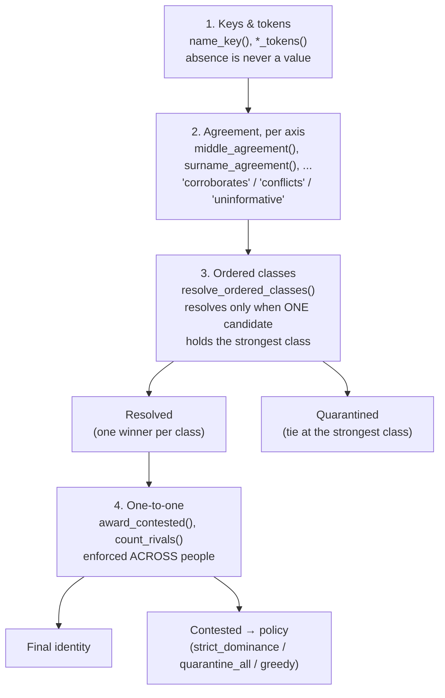
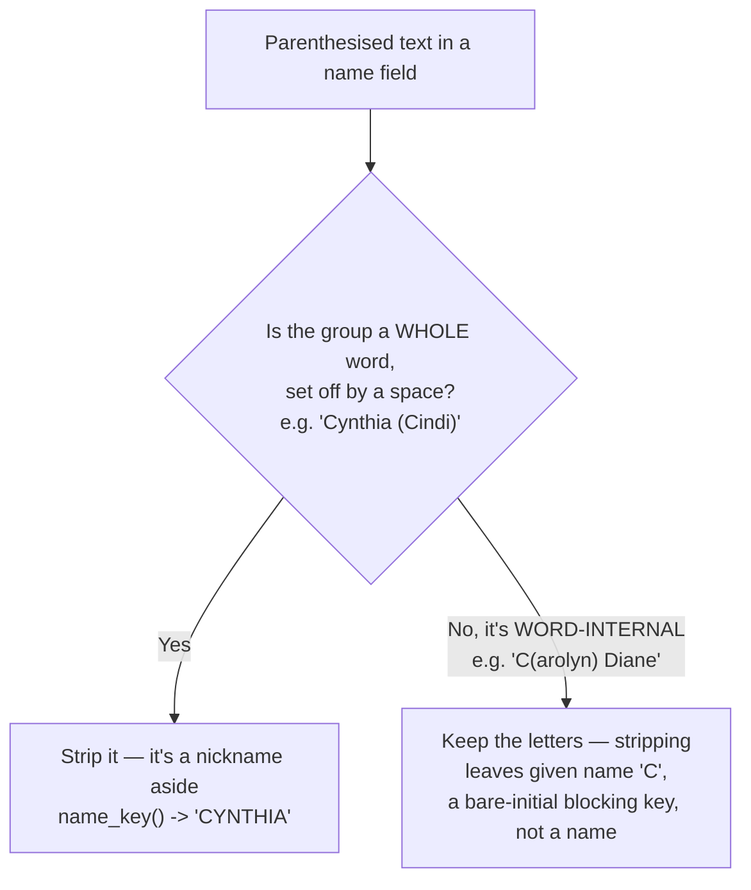
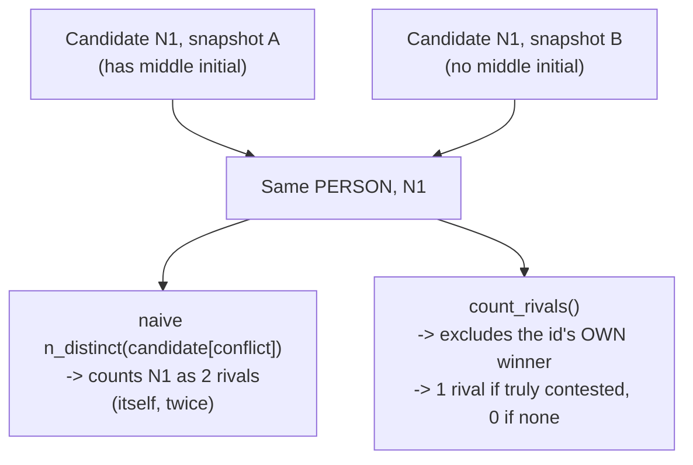

```{r, include = FALSE}
knitr::opts_chunk$set(collapse = TRUE, comment = "#>")
library(mysterynpi)
```

You have a roster of people with names and no identifiers, and a registry with
identifiers and names. Nothing joins them but the names, and names are not
identifiers: two people share one, and one person carries several over a career.

This vignette walks the four stages `mysterynpi` supports, and is explicit
about the fifth it deliberately does not.



## 1. Keys, where absence is not a value

```{r}
name_key("Álvarez")            # transliterated, so it can reach "ALVAREZ"
first_initial("Álvarez")       # "A", never the accented letter
has_name_information(NA)       # FALSE -- nzchar(NA) would say TRUE
blank_na(NA_character_)        # "" only where you asked for it
```

The `NA` handling is not fussiness. `nzchar(NA_character_)` is `TRUE`, and in
one pipeline that single fact made every absent middle name agree with every
other absent middle name: all 18,397 candidate pairs reported middle agreement
and the evidence class meaning "exact name, no middle information" was empty.

Rosters also fuse middle names into the given-name column, and publish
preferred names inline:

```{r}
split_given("Julie Ann")
name_key("Cynthia (Cindi)")    # the nickname leaves the key
name_key("C(arolyn) Diane")    # but word-internal brackets are LETTERS
```

The second and third differ for a reason: dropping the group in
`C(arolyn)` leaves a given name of `"C"`, which is not a name — it is a
blocking key that joins to everyone whose given name is a bare initial.



## 2. Agreement, on token sets

```{r}
ag <- function(a, b) middle_agreement(middle_tokens(a), middle_tokens(b))
ag("A REINHARD", "REINHARD")     # a shared token, wherever each side keeps it
ag("VL", "VELMA LAURITZEN")      # concatenated initials ARE initials
ag("JANE", "DENISE")             # the veto still vetoes
ag("", "MARIE")                  # absence decides nothing
```

Three verdicts, and the middle one is load-bearing. `"uninformative"` is what
*absence* yields; it means this axis decides nothing here. **Do not treat it as
agreement.** A caller that collapses it into "corroborates" has silently
promoted every missing middle name to positive evidence.

Comparing at position 1 instead scores a maiden surname held in a different
slot as a disagreement. In the pipeline this came from, that deleted the only
candidate for 82 people, who were then published as "no candidate" —
indistinguishable from absence from the registry entirely.

There is **no edit-distance tolerance** here. One was added and removed the same
day: it was worth 22 records and it admitted `JULIA`/`JULIE`, `LEE`/`LEA`,
`ANN`/`ANNE`, which are different given names.

**Known limitation:** a hyphenated given name does not corroborate its own
first component. `nickname_agreement("POUL-HENNING", "POUL")` is
`"conflicts"`, not `"corroborates"`, because there is no table edge from the
compound form to its lead component and no initial-compatibility rule covers
it either. This is not a deliberate policy the way the no-edit-distance
stance is -- it is an unaddressed gap, pinned as current behavior rather than
silently left to surprise a caller. Revisit if roster data turns up real
hyphenated-given-name pairs this silently vetoes.

```{r}
nickname_agreement("POUL-HENNING", "POUL")
```

## 3. Ordered classes, not a blended score

You assign the classes; the package resolves them. A record resolves **only**
when exactly one candidate occupies its strongest available class.

```{r}
cand <- data.frame(
  id             = c("p1", "p1", "p2", "p2", "p3"),
  candidate      = c("n1", "n2", "n3", "n4", "n5"),
  evidence_class = c(1L,   2L,   2L,   2L,   3L),
  tax            = c("midwife", "nursing", "midwife", "nursing", "midwife"),
  stringsAsFactors = FALSE)

r <- resolve_ordered_classes(cand, facet = "tax",
                             confidence = c(1, .9, .7, .5, .35))
r$resolved[, c("id", "candidate", "evidence_class", "confidence")]
r$quarantined
```

`p2` has two candidates at class 2 and does not resolve — even though one is a
midwife and the other is not. **A facet may not break the tie.** Taxonomy says
what a record is *for*, not *which person* the name refers to; letting it decide
turns a resolver into a plausible-match machine.

Pass `tiebreak` whenever a person can have two rows for one candidate. Without
it the retained row depends on input order: a permutation suite found the
recorded name variant changed in 231 of 300 orderings.

## 4. One person, one record — and what to do when two claim it

Identifiability is a property of one person's evidence and must not depend on
another person's claim, so the constraint runs *after* individual resolution.
A **contested** candidate is one two people each resolved to independently.

```{r}
contested <- data.frame(
  id        = c("p1", "p2", "p3", "p4"),
  candidate = c("n1", "n1", "n2", "n2"),
  rank      = c(1L,   2L,   3L,   3L),      # n1 separable, n2 an exact tie
  stringsAsFactors = FALSE)

award_contested(contested, "strict_dominance")[, c("id", "candidate")]
nrow(award_contested(contested, "quarantine_all"))
nrow(award_contested(contested, "greedy"))
```

Measured on one real cohort with 93 contested candidates:

| policy | recovered | identities decided by **sort order** |
|---|---|---|
| `quarantine_all` | 0 | 0 |
| `strict_dominance` | 56 | 0 |
| `greedy` | 93 | **37** |

The 37 tie on every ranking key, 10 of them at the strongest class — two people
whose full names *and* middle names both match one record. `greedy` hands those
to whoever sorts first. It exists only because reproducing a cohort frozen
before this distinction was drawn requires it.

"Sorts first" means the claimant `id` that sorts lowest, not whichever row
happened to arrive first: `award_contested()` re-sorts on entry, so its
result -- for every policy, including `greedy` -- does not depend on the
input's row order. The id comparison genuinely decides the tie; shuffling the
input beforehand cannot.

When you count what a veto removed, count *people*, not rows:

```{r}
count_rivals(
  data.frame(id = c("p1", "p1"), vetoed = c("n1", "n2"),
             stringsAsFactors = FALSE),
  data.frame(id = "p1", candidate = "n1", stringsAsFactors = FALSE))
```

One rival, not two. A temporal registry's unit is (candidate × snapshot × name
variant): one person recorded with a middle initial in one snapshot and without
it in another supplies both a conflicting and a non-conflicting row, and a naive
count treats a person as evidence *against* the match that belongs to them. That
cost two false demotions before it was understood.



## 5. What this package does not do

**Blocking.** Which candidates to generate — exact name, surname plus initial,
fuzzy surname, surname component — and which class each earns, is where a study
declares what it will claim from a name. That belongs in your pipeline, in code
a reviewer can read, not behind a dependency.

**Scoring gates.** Gender and credential gates encode claims about identity.

**A nickname dictionary.** Whether `BETH` may stand for `ELIZABETH` is a claim
about your population, not a fact about strings.

## 6. Two name lists: match each to NPI, then join on NPI

A question every consumer eventually asks: if we have two lists of
physician names, should we match each list to its own NPIs, or match the
names on one list to the names on the other?

Match each list to NPI first, then join the two lists on NPI. That is the
better design for physician data, for four reasons.

- **NPI is a stable, unique key.** Names are not: married-name changes,
  nickname variants, suffixes, and the same name held by two different
  doctors all break a direct name-to-name match. Once each list carries an
  NPI, the cross-list join is exact and auditable.
- **NPPES gives you more fields to match on.** Matching a name against
  NPPES lets you use specialty taxonomy, state, city, credential, and gender
  as blocking and scoring fields. Matching two thin name lists against each
  other gives you only what the two lists share, which is often just a name.
- **Each list's match quality can be measured separately.** You get a
  per-list match rate and a per-list set of unresolved names, so
  availability and resolution are reported as two numbers. A direct
  name-to-name match blends both lists' failures into one unexplained
  residual.
- **The result is reusable.** An NPI-keyed list joins to Medicare, board
  certification, and every other source a consumer holds. A name-to-name
  crosswalk is good for one pairing only.

This package is the canonical identity layer that the isochrones project
uses to resolve ABOG, ABMS, and NPPES physician names to NPI, so a new list
goes through the same ordered-class resolution described above (or
`match_npi()`, see `vignette("end-to-end-nppes-matching")`) rather than
through a fresh fastLink or reclin2 model.

Two caveats. If a list has no geography or specialty and the names are
common, NPI matching will leave ambiguous residuals; use the second list as
corroborating evidence for those cases rather than as the primary key. And
always keep the unresolved names as an explicit bucket instead of dropping
them, so the denominators still sum.

## Pinning the behaviour you rely on

Run this in *your* test suite:

```{r}
assert_middle_agreement_contract()
```

Any change to this package that flips one of its assertions is a **major**
version bump. This matters more than it looks: the pipelines this code was
extracted from already shared functions by `source()`-ing across repositories,
and a consolidation upstream that moved a default argument killed a caller
mid-run — and would have *silently* mismatched a caller whose data happened to
carry a column named by the new default. Pin a version, and run the contract.
